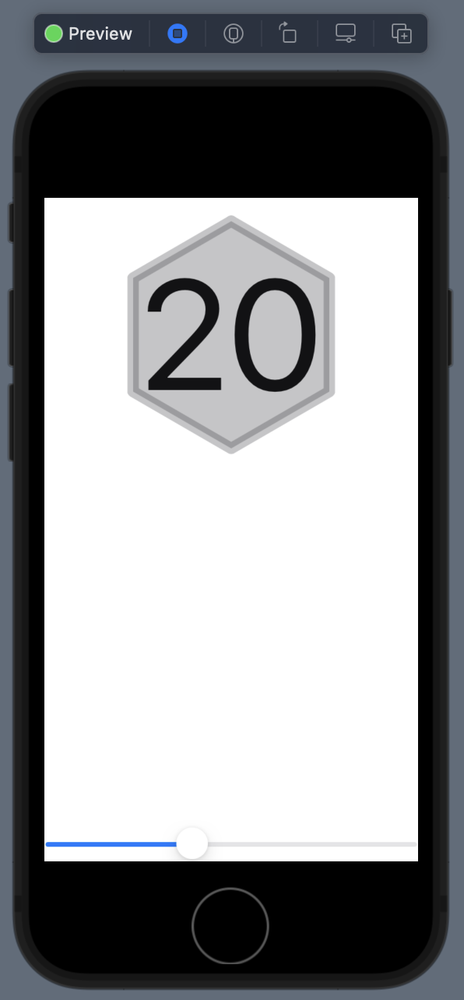

# DiceShapes
Experiments in making simple dice shapes programatically to allow for infinite scaling and accessibility. 

This is a work in progress for another app, I am just leaving the experiments public in case anyone else might want to use similar swiftui code in a project. Feel free to read the code and implement what you want in your own project.

There is not much here yet, just some layers for a basic hexagon. The shape comes up often when looking top down on unusual sided dice, d8 d10 and d20 are all hexagons when viewed in an orthographic perspective, just with variations in the relative side lengths.

